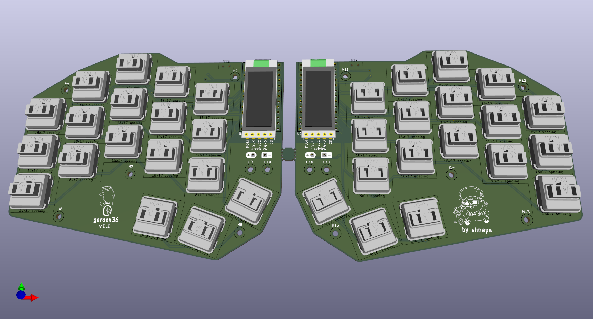
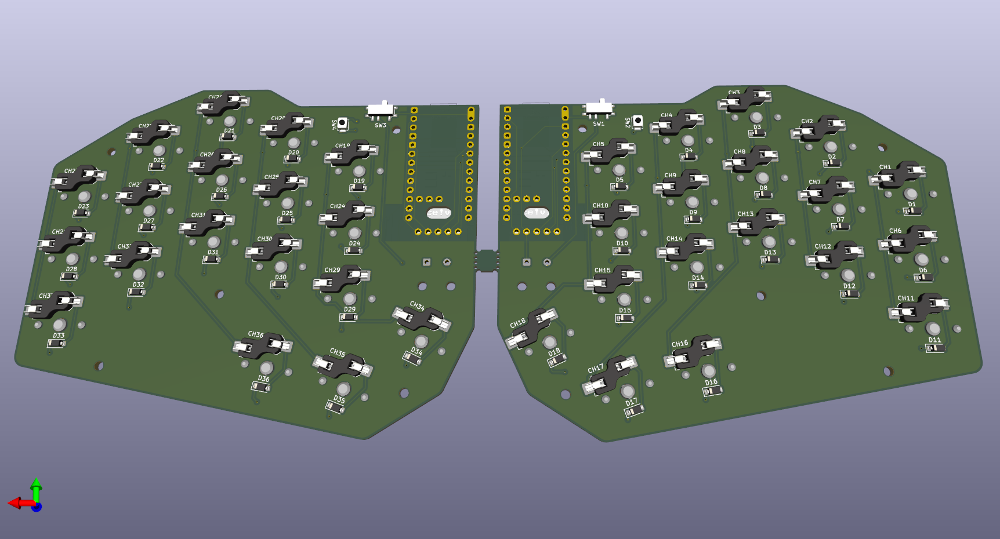

# garden36 🌱

A 36-key wireless split keyboard with Kailh Choc hotswap switches, nice!nano v2 controllers, and nice!view displays.

  

  
  
  
  

---

## Features

- **36 keys** — 3×5 column-stagger + 3 thumb keys per half
- **Wireless** — nRF52840 via nice!nano v2, ZMK firmware
- **Hotswap** — Kailh Choc v1 sockets, swap switches without soldering
- **Display** — nice!view MIP display per half (WPM, layer, battery)
- **Battery** — JST-PH LiPo connector + power switch per half
- **Low profile** — Choc spacing, slim build

---

## Gallery

| Top | Bottom |
|-----|--------|
|  |  |

> Photos of the built keyboard coming once V2 is assembled. See `pics/photos/` for updates.

---

## Bill of Materials

Full BOM with source links: [docs/bom.md](docs/bom.md)

| Component | Qty |
|-----------|-----|
| nice!nano v2 | 2 |
| nice!view | 2 |
| Kailh Choc v1 switch | 36 |
| Kailh hotswap socket CPG135001S30 | 36 |
| 1N4148W diode SOD-123 | 36 |
| MSK12C02-HB power switch | 2 |
| B3U-1000P reset button | 2 |
| JST S2B-PH-SM4-TB battery connector | 2 |
| LiPo battery ~110–300 mAh | 2 |
| M2 standoffs + screws | ~28 |
| Choc keycaps | 36 |

---

## PCB

Gerbers and drill files for JLCPCB/PCBWay are in the [latest release](https://github.com/shnaps/garden36/releases/latest).

DXF and SVG edge cuts for laser-cutting plates: [`exports/`](exports/)

---

## Build Guide

Step-by-step assembly instructions: [docs/buildguide.md](docs/buildguide.md)

---

## Firmware

ZMK config: [github.com/shnaps/zmk-config](https://github.com/shnaps/zmk-config)

Flash via UF2 — double-tap reset on each half to enter bootloader, drag-and-drop `.uf2`. See build guide for details.

---

## Case

A **parametric case generator** lives in [`case-gen/`](case-gen/) — it builds
the case (bottom tray, choc switch plate, controller cover) straight from
`garden36.kicad_pcb`, so it always fits the board. Print files in
`case-gen/out/`. See the [case-gen README](case-gen/README.md) for hardware,
parameters, and the in-progress controller-on-bottom redesign.

Older hand-built STEP files remain in [`case/`](case/).

---

## Design History

- **V1** — initial design, 5-column, wired (see [`v1` branch](https://github.com/shnaps/garden36/tree/v1))
- **V2** (current) — redesigned with wireless, nice!view displays, hotswap

---

## Credits

- [marbastlib](https://github.com/ebastler/marbastlib) by ebastler — Choc switch and controller footprints
- [nice!keyboards](https://nicekeyboards.com) — nice!nano and nice!view hardware
- Split keyboard inspiration: [MRIYA](https://github.com/themaxbang/MRIYA), [temper](https://github.com/raeedcho/temper), [urchin](https://github.com/duckyb/urchin)

---

## License

[MIT](LICENSE) © 2025 Viachaslau Ravinski
