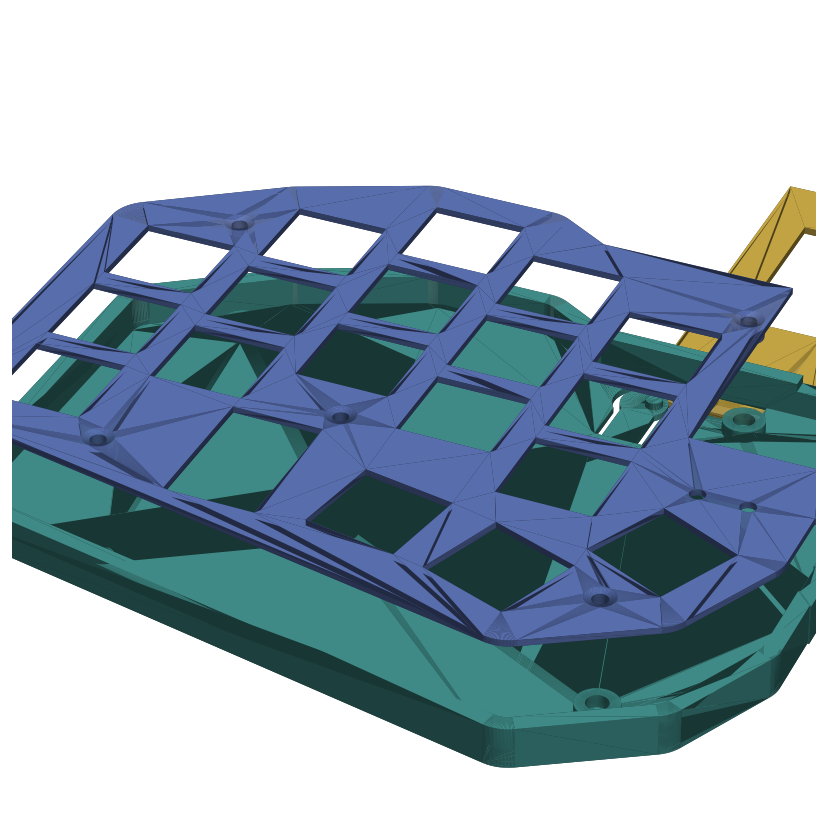

# garden36 — parametric case generator

Generates the 3D-printed case directly from `garden36.kicad_pcb`, so the case
always fits the board. Reads the board outline, switch positions (with splay),
mounting holes, and the controller / nice!view / power / reset / battery
locations, then builds each part as a STEP + STL.



> **Status: work in progress.** Geometry is print-tested and iterating. A
> larger redesign is planned — see *Next* below.

## Parts (per half)

| File | What |
|------|------|
| `*_bottom` | tray: floor, perimeter wall, 5 printed standoffs (insert pockets), printed reset flexure, power-switch slot, USB notch |
| `*_top` | choc switch plate (rotated cutouts follow key splay), logo windows, controller opening, screw bosses |
| `*_cover_view` | flat controller cover with nice!view window, floats on the 2 battery standoffs |
| `*_cover_plain` | same cover, solid (display removed) |

Outputs land in `out/stl/` (slicer) and `out/step/` (CAD).

## Hardware (per half)

| Use | Part |
|-----|------|
| 5 case columns | printed standoff + **M2×3×OD3.5 heat-set insert** + **M2×8 countersunk** from plate |
| Controller cover (display) | **M2×10** F-F standoff at each battery hole + **M2×4** screws |
| Controller cover (plain) | **M2×7** F-F standoff instead |

## Run

```bash
# one-time env (build123d needs Python <=3.12)
uv venv --python 3.12 .venv-case
uv pip install --python .venv-case build123d numpy-stl matplotlib

# generate
.venv-case/Scripts/python extract_pcb.py   # PCB -> pcb_data.json
.venv-case/Scripts/python case_gen.py       # -> out/stl, out/step
```

Edit a PCB feature in KiCad → rerun both → the case refits.

## Key parameters (`case_gen.py`)

All in mm, top of file. The ones that matter for fit:

- `UNDER_PCB` — space under the PCB (choc socket clearance + insert seat)
- `ABOVE_PCB` — plate underside above PCB = where the choc switches hold the
  plate. **Tune this to your exact top/bottom gap** (1.6mm plates sit ~1mm proud
  of the 1.2–1.3 clip notch)
- `PLATE_T` — 1.6 (held by screws). Drop to 1.3 if you want choc clips to engage
- `CTRL_STANDOFF` / `DISPLAY_TOP` — controller cover height; must clear the
  nice!view

## Next — controller-on-bottom redesign

Resoldering the nano to the **bottom** of the PCB (the footprints are fully
through-hole / reversible, so no board respin needed). This lets the nice!view
sit low on top instead of stacked on the nano → near-flush top, USB-C notch
moves to the bottom wall, battery moves under the PCB. Case will be regenerated
for that stack once the board is reworked.
